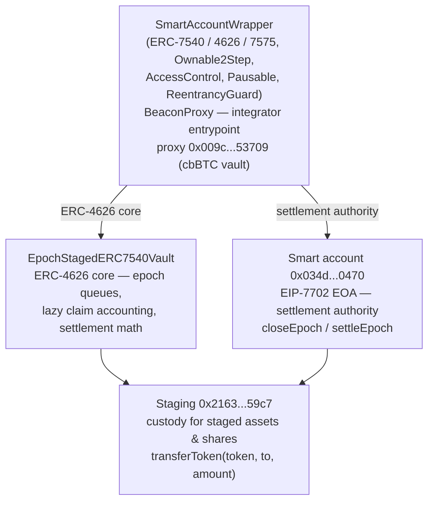
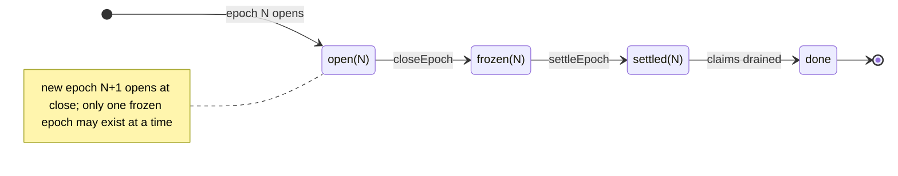

# System design

Condensed from the canonical [`ARCHITECTURE.md`](https://github.com/K3-Capital/k3-vault-contracts/blob/main/ARCHITECTURE.md) — refer there for full depth.

## Component map

- **`SmartAccountWrapper`** (`src/SmartAccountWrapper.sol`, 182 lines) — upgradeable entrypoint. Adds pausing (`whenNotPaused` on both request paths), `pause/unpause` (owner or `PAUSER_ROLE`), `setSmartAccount` (owner, only when no frozen epoch), `rescue(token, amount)` (owner; asset surplus → smart account, other tokens → owner), `rescueStagedToken` (owner; cannot touch the vault asset or share token), `smartAccount()` view, and the ERC-165 advertisement for ERC-7540, ERC-7575, and `IEpochSettlementPreview`.
- **`EpochStagedERC7540Vault`** (`src/EpochStagedERC7540Vault.sol`, 745 lines) — the accounting core: per-epoch request queues, lazy claim accounting, `previewSettlement`, `totalAssets()` (= `activeAssets`), `assetSurplus()` (asset balance of the vault), `redeemClaimReserves()`, `share()`/`vault()` (ERC-7575), and async-revert ERC-4626 previews.
- **`Staging`** (`src/Staging.sol`) — minimal custody contract created at initialization. Holds deposits awaiting settlement and shares/assets awaiting claims; exposes `transferToken(token, to, amount)` callable only by the vault.
- **Interfaces** — `src/IEpochStagedERC7540Vault.sol` and `src/IEpochSettlementPreview.sol` are what integrators code against.

## Storage & accounting model

- Per-epoch state (`EpochData`): `closed`, `settled`, `totalDepositAssets`, `totalRedeemShares`, and `depositAssets[controller]` / `redeemShares[controller]` maps. Controllers are linked into per-controller epoch queues (`first/next/last`) so claims process oldest-first.
- `SettlementData` per settled epoch records the snapshots and the running per-epoch claim tallies (`depositAssetsClaimed`, `depositSharesClaimed`, `redeemSharesClaimed`, `redeemAssetsClaimed`).
- Per-controller claim tallies (`DepositClaimData`, `RedeemClaimData`) enable lazy, partial claims.
- `activeAssets` is updated at settlement to `navSnapshot − redeemAssetsReserved + totalDepositAssets`; `totalAssets()` returns it.
- The last unclaimed controller of an epoch absorbs all rounding dust, so per-controller floor rounding can never strand assets or shares in Staging.

## Staging

Assets move only along this path: user → Staging (at `requestDeposit`) → vault (at settlement, plus a reserve top-up for redeems) → redeemer via Staging (at `withdraw`/`redeem`). Deposit claims transfer minted shares from Staging. Because Staging only ever releases to the vault or to entitled claimants, user funds are never held outside these two contracts.

## Epoch state machine

`closeEpoch` reverts if an epoch is already frozen (`SA__FrozenEpochPending`); `settleEpoch` must target exactly the frozen epoch (`SA__WrongEpoch`), which must be closed and not already settled.
