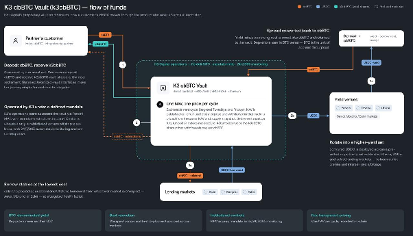

# Product Overview

A K3 Vault is a dedicated smart contract, deployed on an EVM chain, that performs three functions:

1. It accepts a single asset and issues vault shares against it.
2. It places the pooled capital under K3's management within a defined mandate, subject to MPC-based key controls and continuous monitoring.
3. It prices every deposit and withdrawal at one common value in each settlement cycle.

Six principles shape the design of every K3 Vault:

- **One asset in, one asset out.** The depositor supplies the vault's asset and receives vault shares; redemptions pay out the same asset. The depositor is not required to manage intermediate tokens or venue-specific positions.
- **Batch pricing.** All requests in a settlement cycle share one NAV and one supply snapshot. No participant obtains a better price by timing a request within a cycle.
- **A defined custody path.** Pending requests and settled claim reserves move between the customer, the Staging custody contract, and the vault. Capital available for strategy execution is swept to the vault's operational account at settlement.
- **Verifiable accounting.** Each settlement is recorded on-chain. The settlement arithmetic is public and can be previewed by anyone, without permission, against the snapshots actually used.
- **Policy-constrained discretion.** K3 allocates actively, but only to venues allowed by the operating mandate and permission policies, within monitored limits, with keys held under MPC and the portfolio under continuous monitoring. The vault contract itself does not enforce the investment mandate unless a specific vault's materials state otherwise.
- **Separation of authorities.** The authority that prices and settles cycles is distinct from the authority that administers the contract, including pause and upgrade powers. Staging cannot release the vault asset or share token except through the vault's claim and settlement paths.

## Flow of funds, step by step

This section follows a unit of capital through the K3 cbBTC Vault. Other K3 Vaults can use the same request → settle → claim pattern, while their asset, mandate, and terms may differ.

| Field | Value |
|---|---|
| Name / symbol | K3 cbBTC Vault / `k3cbBTC` |
| Network | Ethereum mainnet (chain ID 1) |
| Deposit asset | [`cbBTC`](https://etherscan.io/token/0xcbb7c0000ab88b473b1f5afd9ef808440eed33bf) (`0xcbB7C0000aB88B473b1f5aFd9ef808440eed33Bf`) |
| Share token decimals | 8 (matches cbBTC) |
| Vault address integrators use | [`0x009c02a73706a68e0aE0209235408206E4F53709`](https://etherscan.io/address/0x009c02a73706a68e0ae0209235408206e4f53709#code) |
| Operational address | `0xd11A33D9F86b4cd64F65AFE413B8B8D8A5352f7B` |
| Deployed | 2026-08-04 09:00:35 UTC, blocks 25680512–25680513 |
| Standards | ERC-7540 / ERC-4626 / ERC-7575, behind an upgradeable beacon proxy |
| Source verification | Etherscan exact-match for proxy, beacon, implementation, and custody contract |
| Settlement cadence | Targeted Mondays and Fridays (operating target, not an on-chain guarantee) |
| MPC provider | Fordefi |
| Default fees | 0% management, 5% performance; vault-specific terms prevail |

### Deposit: cbBTC in, k3cbBTC out

A user or a partner's customer requests a deposit of cbBTC. The cbBTC is held in Staging until settlement. At settlement, it is converted into `k3cbBTC` vault shares at that cycle's price, and the shares become claimable. The vault uses standard tokenized-vault interfaces so a partner can reuse the integration pattern.

**What K3 adds here:** a single-token journey, fair batch pricing—nobody gets a better price by timing a deposit within a cycle—and an on-chain record of every request and settlement.

### Operated by K3 under a defined mandate

Once a cycle has settled, capital not reserved for withdrawals moves to the vault's operational account. K3's operations team accesses the capital with mandate restrictions and permission policies in place: capital can only be allocated to allowed venues and actions, within monitored limits. The portfolio is watched by continuous automated monitoring with an on-call response team behind it.

> **What K3 adds here:** institutional controls between the contract and the market. Keys are MPC-managed, allocations are constrained by operating policy, and monitoring is continuous.

### Strategy execution: a BTC-denominated spread trade

The cbBTC mandate is a spread trade executed in three movements.

#### Borrow stablecoins at the lowest available cost

K3 posts cbBTC as collateral and borrows USDC from a lending market in the vetted set, such as Aave, Morpho, Spark, or Euler, based on available borrowing costs while maintaining the position at a targeted health factor.

#### Deploy into a higher-yielding, pre-vetted set

The borrowed USDC can be allocated across permitted opportunities such as Pendle fixed-rate markets, Ethena, USDai, and selected Morpho and Euler markets, including on newer chains. The objective is to harvest risk premia and liquidity-mining incentives, earning a spread over the stablecoin borrowing cost.

#### Convert the spread back into cbBTC

Yield net of borrowing cost is converted into cbBTC and returned to the vault. Returns therefore accrue to the `k3cbBTC` share price in BTC terms. This objective does not remove the strategy, leverage, venue, liquidity, or counterparty risks described below.

> **What K3 adds at this step:** execution across eligible markets rather than reliance on a single venue, a continuously re-evaluated opportunity set, and returns denominated in the asset the depositor holds.

#### Settlement: one NAV, one price per cycle

On the targeted operating cadence—Mondays and Fridays for `k3cbBTC`—K3 closes the open cycle, values the portfolio, and publishes the resulting NAV on-chain. The contract prices every deposit and withdrawal in that cycle from the same NAV and supply snapshot: it mints shares for depositors, reserves cbBTC for redeemers, and releases the remainder to the strategy. If the vault cannot fully fund the withdrawals due in a cycle, settlement does not execute. Returns accrue to the `k3cbBTC` share price; withdrawals pay out cbBTC.

> **What K3 adds at this step:** transparent, reproducible pricing. The settlement arithmetic is public, anyone can preview it without permission, and every price is recorded on-chain. The NAV input remains operator-computed and is not independently verified by an on-chain oracle.

## What the contract guarantees, and what K3 Capital does

It is important to distinguish the properties the smart contract enforces from the functions K3 performs as operator.

### Enforced by the smart contract

- One price applies to each settled cycle, identically to every request in that cycle.
- Settlement reverts unless the vault holds enough of the asset to cover every withdrawal due in that cycle.
- At most one cycle can be closed but unsettled at any time.
- Deposits waiting in Staging are not counted in the portfolio NAV.
- Staging releases the vault asset and shares only through the vault's settlement and claim paths.
- Pausing stops new requests. It does not stop settlement or claims that are already available.

### Performed by K3 operations (off-chain, policy-based)

- Computing the NAV used at each settlement. Third-party oversight may be available for custom solutions.
- Closing and settling cycles on the target cadence.
- Allocating capital within the mandate. Unless a specific vault's materials state otherwise, the vault contract does not enforce that investment mandate.
- Monitoring the portfolio and responding to incidents.

Depositors and partners should read the first list as properties they can verify on-chain and the second as trust assumptions about K3 as operator. Both are examined in depth in the [Architecture](../architecture/system-design.md) section.

## Risk considerations

This section summarizes the principal categories of risk inherent in a K3 Vault. It is not exhaustive. The governing documents of each vault contain the authoritative risk disclosures for that vault and should be read in full before participating.

**Operator and valuation risk.** The NAV is computed off-chain by K3 and published on-chain at settlement. No on-chain price feed independently verifies it by default; an incorrect NAV misprices the cycle to which it applies. Mandate limits—permitted venues, position limits, and concentration rules—are operating policies monitored by K3, not constraints enforced by the contract unless a specific vault's materials state otherwise. Depositors therefore rely on K3's controls, key management, and conduct as operator.

**Strategy and leverage risk.** Spread strategies borrow against collateral. A sharp fall in the collateral's price, a rise in borrowing costs, or a decline in yields on the deployed side can compress or invert the carry trade and, in adverse conditions, expose the collateral position to liquidation. K3 Capital maintains positions at a targeted health factor and rebalances actively, but leverage amplifies outcomes in both directions.

**Venue and counterparty risk.** Every lending market and yield venue within a mandate carries its own smart-contract, oracle, governance, and liquidity risks. Venues built on synthetic or yield-bearing stablecoins additionally carry issuer, reserve, and peg risk. A failure or impairment at any venue can reduce the vault's NAV.

**Smart-contract risk of the vault itself.** The K3 vault contract suite has been independently reviewed. A security review narrows the risk of defects but cannot prove their absence.

**Liquidity and timing risk.** Deposits and withdrawals are processed only at settlement. The settlement cadence is an operating target, not a commitment: cycles close and settle at K3's discretion, and settlement does not execute if withdrawals due in a cycle cannot be fully funded. A request cannot be cancelled once submitted.

**Administrative and key-management risk.** The owner can upgrade the vault implementation, pause new requests, and change the settlement authority. At the documented snapshot these authorities are held by single accounts secured through MPC policy controls rather than by an on-chain multisig or timelock.

**Operator-approval risk.** A depositor who approves an operator grants that operator the ability to commit the depositor's assets to deposit requests and direct the proceeds of the depositor's claims to any address. Approvals should be granted deliberately and revoked when no longer required.

Continue to the [FAQ](faq.md), or read the technical [Security & trust assumptions](../architecture/security-assumptions.md).
