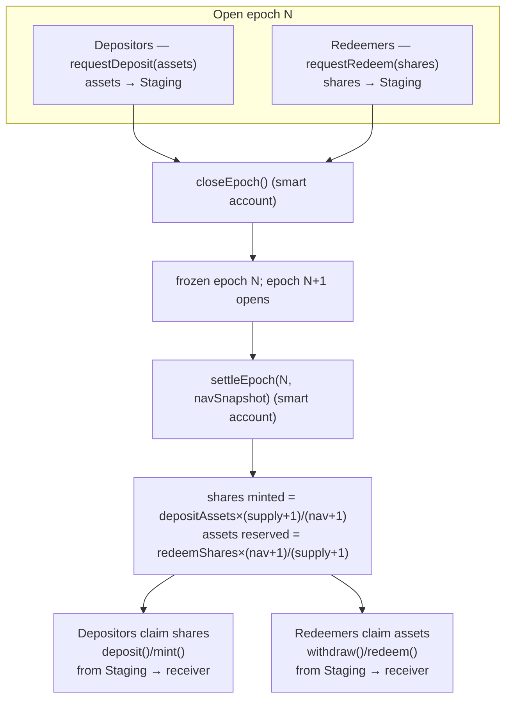
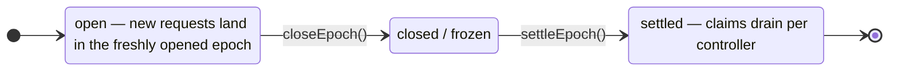

# How it works

The full journey of a deposit and a redemption through the epoch lifecycle. All function names link to their reference entries.

## Step by step

### 1. Request

- `requestDeposit(assets, controller, owner)` pulls `assets` of the underlying token from `owner` into the [Staging](../architecture/system-design.md#staging) contract and queues them under `controller` in the open epoch. Returns `requestId`, which **equals the epoch id** the request joined.
- `requestRedeem(shares, controller, owner)` escrows `shares` of the vault token in Staging and queues them under `controller`.

The caller must be the `owner`, the `owner`'s approved operator, or — for redeem — an ERC-20 allowance spender. See [operator approvals](../integration/operator-approvals.md).

### 2. Close

`closeEpoch()` (smart account only) marks the open epoch `closed` and freezes it (`frozenEpochId`), opening epoch `N+1` for new requests. Emits `EpochClosed`.

### 3. Settle

`settleEpoch(epochId, navSnapshot)` (smart account only) prices the frozen epoch:

- `depositShares = depositAssets × (supply+1) / (nav+1)` (floor)
- `redeemAssets = redeemShares × (nav+1) / (supply+1)` (floor)

using the OZ "virtual offset" formula with offset zero, where `supply` and `nav` are the snapshots passed by the smart account. Inflows are moved from Staging to the vault, reserves for redeemers are staged, share mint/burn is applied, and any asset surplus above the redemption reserve is swept to the smart account. Emits `EpochSettled` — the authoritative price record for the epoch.

Any of `previewSettlement(nav, supply, depositAssets, redeemShares)` can be called (permissionless) to compute these numbers for arbitrary inputs; the contract advertises the interface via ERC-165.

### 4. Claim

After settlement, per-controller claims become available, processed **oldest settled epoch first**:

- Depositors: `claimableDepositRequest(requestId, controller)` returns claimable assets; `deposit(assets, receiver)` / `mint(shares, receiver)` transfers them from Staging and mints/transfers vault shares to `receiver`.
- Redeemers: `claimableRedeemRequest(requestId, controller)` returns claimable shares' worth of assets; `withdraw(assets, receiver)` / `redeem(shares, receiver)` releases them from Staging to `receiver`.

Claims are **lazy**: only the oldest unsettled→settled epoch in a controller's queue is claimable at a time; partial claims are allowed but constrained ([rules](../integration/claim-deposit.md#partial-claims)).

## State machine per epoch

